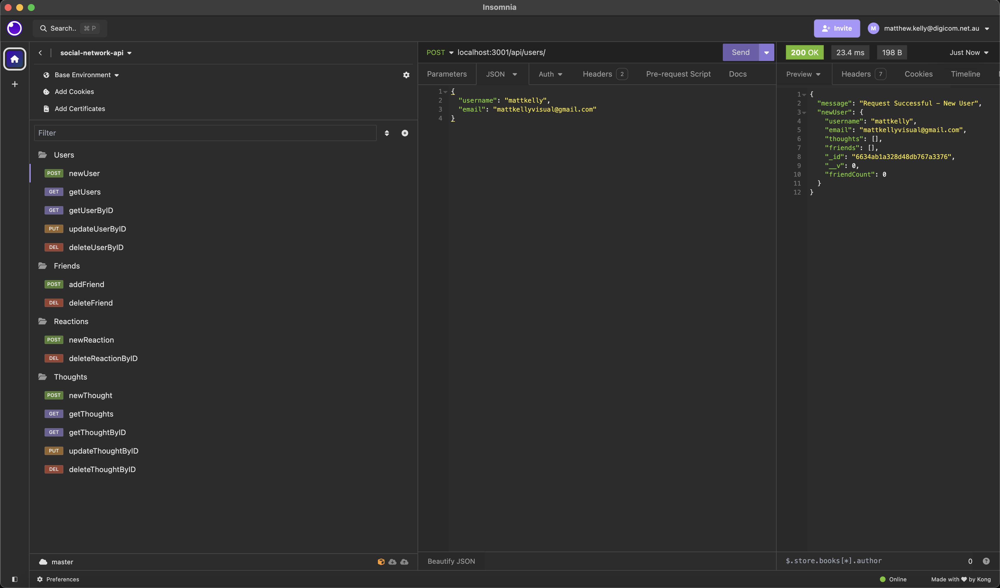
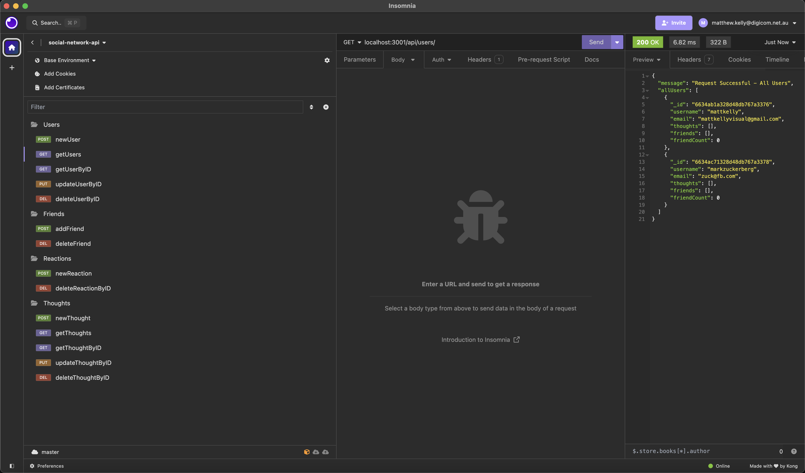
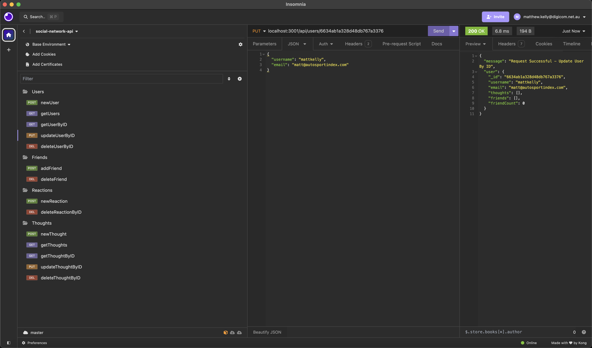
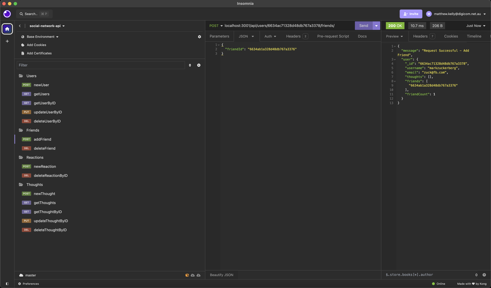
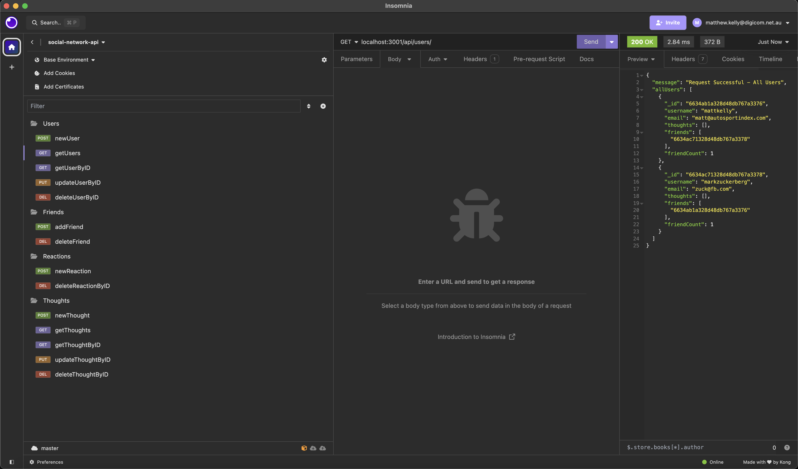
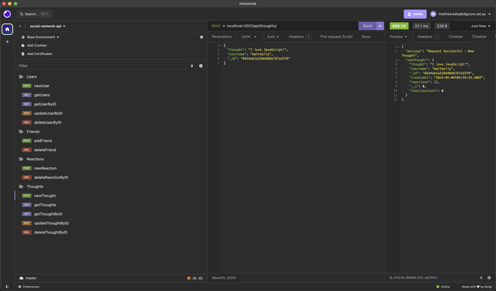
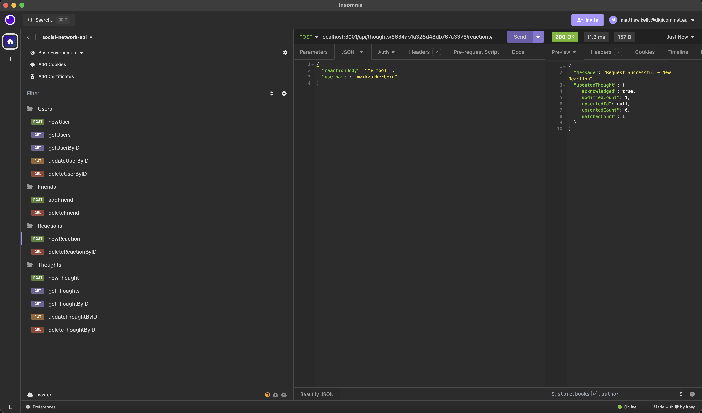
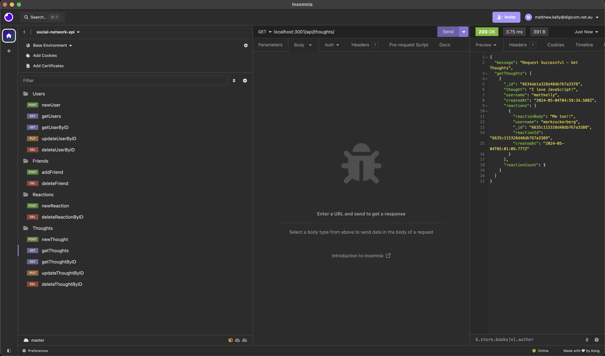

# Social Network API

## Description

Power the success of your social network application with this back end API built with Express.js, Mongoose, MongoDB and NoSQL.

## Table of Contents

- [Description](#description)
- [Installation](#installation)
- [Usage](#usage)
- [Contribution](#contribution)
- [Tests](#tests)
- [License](#license)
- [Questions](#questions)

## Installation Instructions

To install this application, clone this repository to your local machine and install all relevant packages by executing **'npm install'**. Please note, Node.js must be installed on your local machine for this application to run.

## Usage

To view a live demonstation of this application, please visit this [link](https://www.youtube.com/watch?v=79Zb8IPB3Po).

To start the live server for the social network database, execute **'npm start'** or **'node server.js'**.

Use Insomnia (or your preferred API testing application) to test the CRUD operations for the **'socialNetworkDB'** database.

Firstly, seed your database by creating users:

</img>

Once the database has been seeded with users, they can be retrieved via **'getUsers'** or **'getUserByID'** routes from the **'socialNetworkDB'**:

</img>

User data can be updated using the implemented **'updateUserByID'** route:

</img>

Users can also be deleted via the **'deleteUserByID'** route (not demonstrated). Additionally, users can add friends via the **'addFriend'** route:

</img>

Users can delete friends via the **'deleteFriend'** route (not demonstrated). A users **'friendCount'** will update when the number of friends a user has changes:

</img>

Users can add new **'thoughts'** via the **'newThought'** route:

</img>

Users can add **'reactions'** to their own or another users **'thought'**. Adversely, a reaction can be deleted via the **'deleteReactionByID'** route (not demonstrated):

</img>

Each time a new reaction is added to a thought, the **'reactionCount'** for a thought will update. Additionally, routes have been implemented for users to get all thoughts **(getThoughts)**, get thought by ID **(getThoughtByID)**, update **(updateThoughtByID)** and delete **(deleteThoughtByID)**:

</img>

## Contribution Guidelines

This project was developed by Matt Kelly.

## Tests

There are no tests associated with this project.

## License

This project is not licensed. For more information regarding licences, please visit this link: https://opensource.org/license/

## Questions

Please feel free to contact me via my GitHub or email below for any questions associated with this application:  
GitHub: [mattkellyirl](https://github.com/mattkellyirl)  
Email: mattkellyvisual@gmail.com
